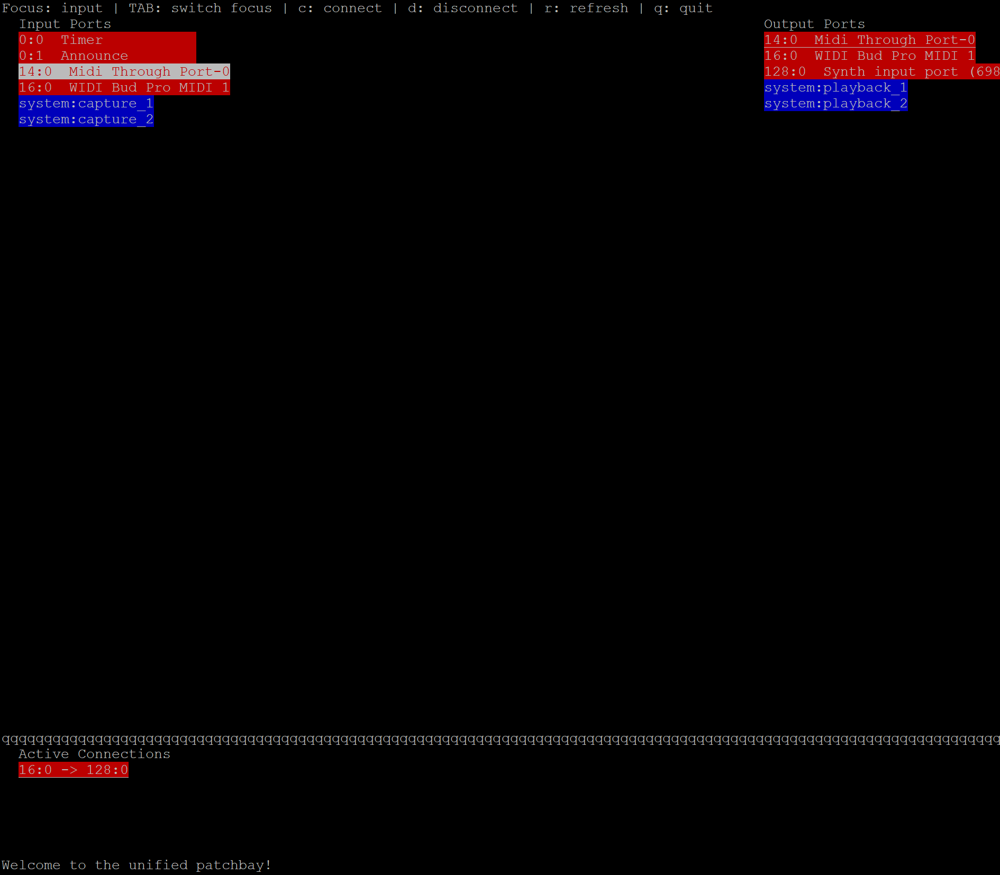

# Patchbay

A unified ALSA and JACK (or PipeWire-JACK) patchbay with a color-coded port display, active connection listing, and scrolling support for panels. It is a simple script writen in python as a  wrapper over ALSA and JACK cli commands.

## Interface

Below is a screenshot of the Patchbay interface:



## Features

- Displays ALSA and JACK (or PipeWire-JACK) ports in separate panels
- Allows users to connect and disconnect ports easily
- Active connections are displayed in a separate panel
- Color-coded interface for ALSA (red) and JACK (blue) ports
- Keyboard shortcuts for quick navigation and actions

## Installation

### Prerequisites

Ensure you have the following dependencies installed:

- Python 3
- `curses` (included with most Python installations)
- `alsa-utils` (for `aconnect` command)
- `jack-tools` or PipeWire (for `jack_lsp`, `jack_connect`, `jack_disconnect`)

### Install Required Packages (Debian/Ubuntu)

```bash
sudo apt update
sudo apt install alsa-utils jack-tools python3
```

For PipeWire users:

```bash
sudo apt install pipewire-audio pipewire-jack
```

### Running the Patchbay

Simply run:

```bash
python3 patchbay.py
```

## Usage

### Key Bindings

- **TAB**: Cycle focus between input, output, and active connections panels.
- **UP/DOWN**: Navigate in the focused panel.
- **c**: Connect the selected input port to the selected output port (if both are the same type).
- **d**: Disconnect a connection.
  - If focus is on the active connections panel, disconnect that connection.
  - Otherwise, disconnect the connection between the selected ports.
- **r**: Refresh the views.
- **q**: Quit the program.

### Port Colors

- **ALSA Ports**: Red background
- **JACK Ports**: Blue background


## Contributing

Feel free to open issues and submit pull requests for improvements and bug fixes.

## License

This project is licensed under the Apache License, Version 2.0
